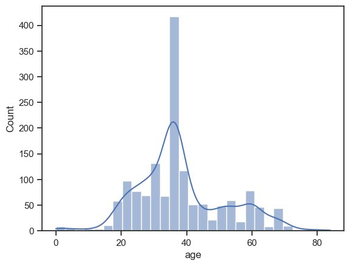
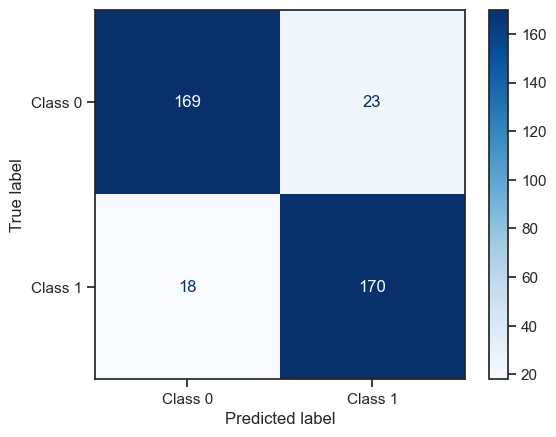
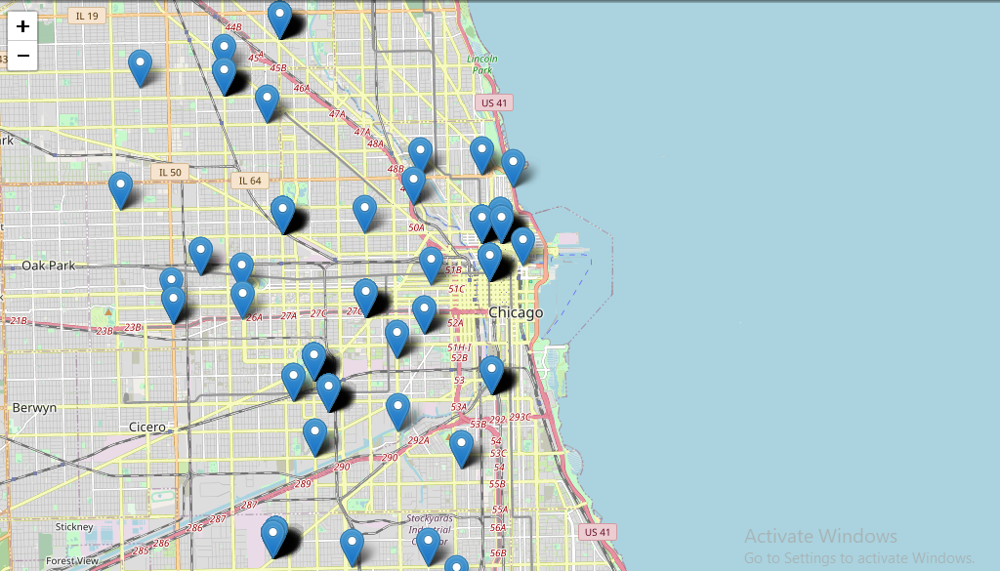

# EXPLORING CRASH DATA AND PREDICTING SEVERITY

# INTRODUCTION
Vehicle accidents are a major source of worry for public safety and transportation agencies. They not only cause death and property damage but also interrupt traffic flow and incur economic losses. Understanding the factors that contribute to these collisions and their effects is critical for putting effective measures in place to decrease their occurrence and impact.

The City of Chicago has collected extensive crash data through its electronic crash reporting system (E-Crash), providing a valuable resource to analyze and gain insights into the factors contributing to accidents. The dataset comprises a wide range of crash parameters, including crash circumstances, vehicles involved, and people affected.

The goal of this study is to analyze the dataset and provide a full understanding of car crashes and their characteristics in the city of Chicago. We hope to discover key factors that contribute to collisions, measure the impact they have, and analyze the circumstances surrounding the accidents by studying the numerous characteristics associated with each crash event.

This project's target audience includes numerous road safety stakeholders such as transportation authorities, law enforcement agencies, policymakers, and insurance companies. Decision-makers can establish focused plans and activities to reduce the frequency and severity of accidents by knowing the fundamental elements that contribute to collisions.

 # BUSINESS UNDERSTANDING
The City of Chicago maintains an electronic crash reporting system (E-Crash) which shows information about each traffic crash on city streets within the City of Chicago limits and under the jurisdiction of the Chicago Police Department (CPD). Data from the CPD's electronic crash reporting system (E-Crash) are displayed without any identifying information. When a crash report is completed or when an existing report in E-Crash receives updates, records are added to the data portal. The drivers involved in most minor incidents self-report about half of all crash reports to the police station, while the other half are documented on the scene by the responding police officer. The reporting officer records several crash parameters, such as information on street conditions, weather, and posted speed restrictions, based on the best information at the moment, but many of these may conflict with posted data or other assessments of road conditions.

The dataset offers useful information for evaluating traffic incidents, spotting patterns, and putting safety measures in place to lower casualties and improve road safety. This information can be used by researchers, decision-makers, and analysts to make more informed choices and enhance overall road transportation systems. The goal of this research is to create a categorization model that will aid in determining the characteristics of an automobile collision that are significant.

# PROBLEM STATEMENT
Traffic accidents occur due to various factors, including vehicle characteristics, driver behavior, road conditions, weather, and traffic patterns. The Vehicle Safety Board and the City of Chicago who are the stakeholder recognize the importance of identifying and understanding the various factors leading to the accidents in order to implement targeted safety interventions and improve overall road safety. From the several factors, the primary objective that we aim to achieve is:

 * To develop a model that can accurately determine the primary cause of car accidents by utilizing data, on vehicles, individuals, and road conditions
 *  To recommend to the City of Chicago Department of Transportation proactive measures to mitigate the risks, injuries and enhance overall road safety.
 
# DATA UNDERSTANDING
We will make use of datasets from the Chicago Data Portal, an open data resource where one may find relevant information about the city. In particular, we will be focusing on three datasets: Traffic Crashes - Vehicles, Traffic Crashes - People, and Traffic Crashes - Crashes.

Dataset 1: CRASH Data Description of Columns:
Some of the columns found in the dataset are:

'CRASH_RECORD_ID':This number can be used to link to the same crash in the Vehicles and People datasets. This number also serves as a unique ID in this dataset.

*CRASH_DATE: Date and time of the crash as entered by the reporting officer

*WEATHER_CONDITION: Weather conditions at the time of the crash, as determined by reporting officer

*ROADWAY_SURFACE_COND: Road surface condition, as determined by reporting officer

*CRASH_TYPE: A general severity classification for the crash. Can be either Injury and/or Tow Due to a Crash or No Injury / Drive Away

The full description of the columns can be found in the data_description.md file.

Insights: When the weather is clear throughout the day, accidents tend to occur more frequently.

Dataset 2: Vehicles Data Description of Columns:
Some of the columns found in the dataset are:

*'CRASH_RECORD_ID':This number can be used to link to the same crash in the Vehicles and People datasets. This number also serves as a unique ID in this dataset.

*CRASH_UNIT_ID: A unique identifier for each vehicle record.

*MAKE: The make (brand) of the vehicle, if relevant

*VEHICLE_USE: The normal use of the vehicle, if relevant

*EXCEED_SPEED_LIMIT_I: Indicator of whether the unit was speeding, as determined by the reporting officer

The full description of the columns can be found in the data_description.md file.

Insights: Passenger vehicles used for personal use are more prone to accidents. We can also see that Toyota and Chevrolet make are leading in the number of accidents with 118 and 114 respectively.

Dataset 3: People Data Description of Columns:
Some of the columns found in the dataset are:

*CRASH_RECORD_ID':This number can be used to link to the same crash in the Vehicles and People datasets. This number also serves as a unique ID in this dataset.

*PERSON_ID: A unique identifier for each person's record. IDs starting with P indicate passengers. IDs starting with O indicate a person who was not a passenger in the vehicle (e.g., driver, pedestrian, cyclist, etc.).

*PERSON_TYPE: Type of roadway user involved in the crash

*SEX: Gender of the person involved in the crash, as determined by reporting officer

*AGE: Age of the person involved in the crash

The full description of the columns can be found in the data_description.mdt file.

Insights: Drivers are more prone to be affected by accidents with 731 cases. Most victims are Males. The most affected age group is between 26-30.

# DATA CLEANING
We performed the taking after information cleaning forms:

*Imported the information.

*Combined the datasets into one information outline.

*Dropped the excess columns.

*Checked the rate of invalid values for each column.

*Dropped the columns with more than 70% invalid values.

*Dropped unimportant columns.

*Filling columns with question information sorts with the 'missing' esteem.

*Filling columns with numeric information sorts with the middle. 

 # EXPLORATORY DATA ANALYSIS
 * Univariate Analysis
 
 
 * Multivariate Analysis
 
 
 # MODELING
 What are the significant factors influencing the severity of traffic crashes, and can they be used to predict the severity level (e.g., minor, moderate, severe)?

Prediction and Evaluation: We Predict outcomes on the test set and evaluate the model's performance using a confusion matrix and classification report.

The model achieved an accuracy of approximately 90%. The classification report provides a detailed breakdown of performance for each class, including precision, recall, and F1-score. The weighted average F1-score gives an overall measure of the model's performance across all classes.

Overall, the model appears to perform well, particularly in identifying "INCAPACITATING INJURY" cases. However, it shows lower recall for the "REPORTED, NOT EVIDENT" class, indicating potential room for improvement in identifying such cases.

Research Question:
 Effectiveness of Safety Equipment:

Research Question: What is the impact of safety equipment usage (e.g., seatbelts, airbags) on the occurrence and outcomes of crashes, and can we quantify their effectiveness in reducing injuries?

 
 The model had the following scores: RMSE: 0.33 Recall: 0.9 Precision: 0.88 Accuracy: 0.89 F1-Score: 0.89
 
 # Research Question:
 
Geographic Hotspots and Prevention Strategies:
Research Question: Can we identify geographic hotspots with higher crash frequencies, and what targeted prevention strategies (e.g., improved signage, traffic control) can be recommended

  
  The model had the following scores: RMSE: 0.58 Recall: 0.61 Precision: 0.72 Accuracy: 0.67 F1-Score: 0.66

# Conclusions
 * The prescient demonstrate illustrated a tall exactness rate in deciding mishap seriousness, especially for cases including debilitating wounds. There's room for advance advancement, particularly in distinguishing cases with detailed but not apparent wounds.

* Geographic examination uncovered regions with higher crash frequencies, proposing focused on mediations like upgraded activity authorization and foundation advancements. The demonstrate anticipated that ranges without activity control gadgets recorded wounds as compared to regions with activity control gadgets.

* Street security In Chicago Pd is an continuous concern that requires nonstop checking and change of procedures based on the information and changing circumstances. 
 
 
# Recommendations
Drawing upon the perceptions and occasions said over, we have the opportunity to define the consequent set of suggestions:

*Standard Observing and Convenient Upkeep of Street Surface Conditions:
It is emphatically exhorted to set up a orderly and careful approach to reliably screen and proactively keep up the condition of street surfaces. Quickly tending to issues such as potholes, splits, and uneven surfaces is of foremost significance to guarantee the security and consolation of drivers and people on foot.

*Cultivating Collaboration with the Car Industry for Improved Vehicle Solidness:
To synergize headways in street security and car innovation, a collaborative organization between the transportation segment and the car industry is exceedingly suggested. By together creating cutting-edge innovations that improve vehicle soundness, such as versatile suspension frameworks and progressed driver help highlights, the collective endeavors can surrender surprising advancements in in general street security.

*Creating Weather-Responsive and Versatile Street Framework:
In arrange to successfully moderate the affect of changing climate conditions on street security and toughness, it is prescribed to set out on the advancement of street foundation that illustrates a tall degree of responsiveness to shifting climatic variables. 